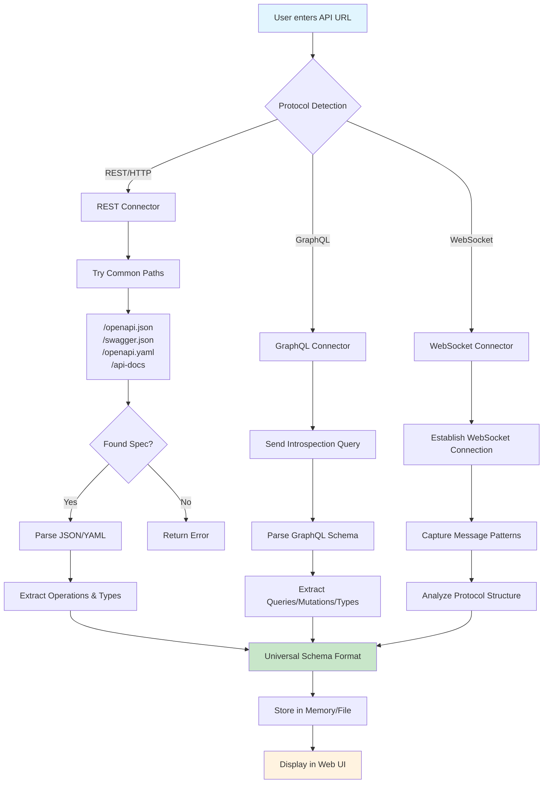
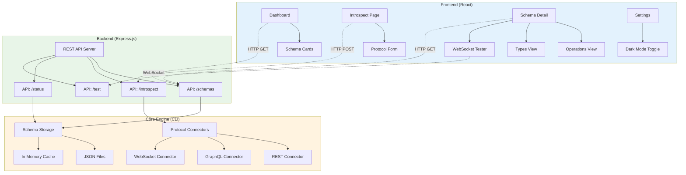
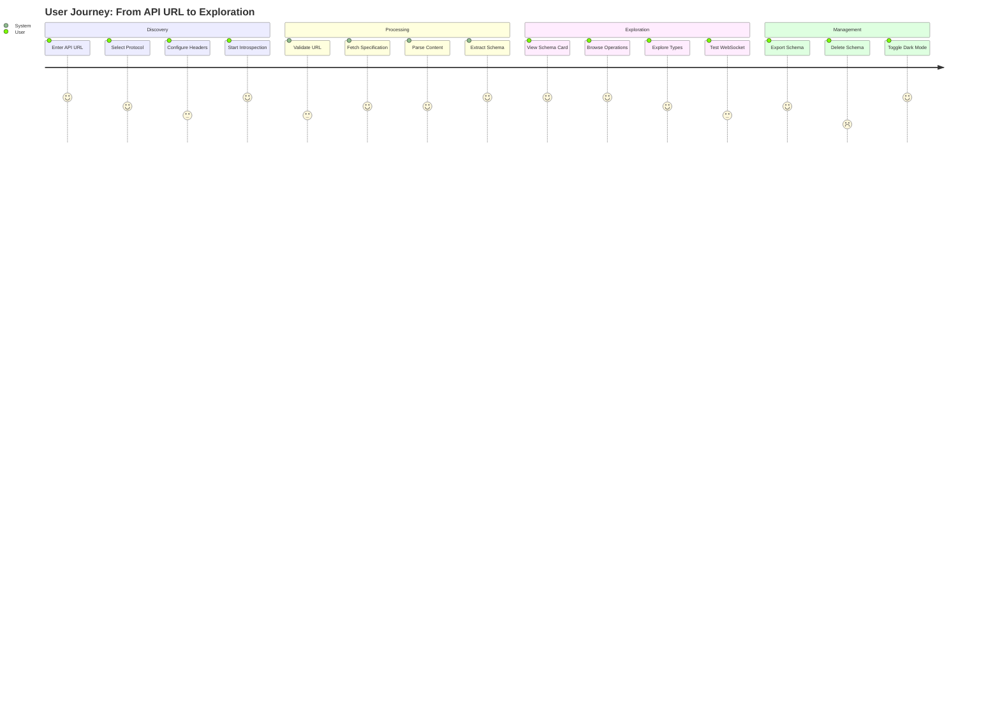
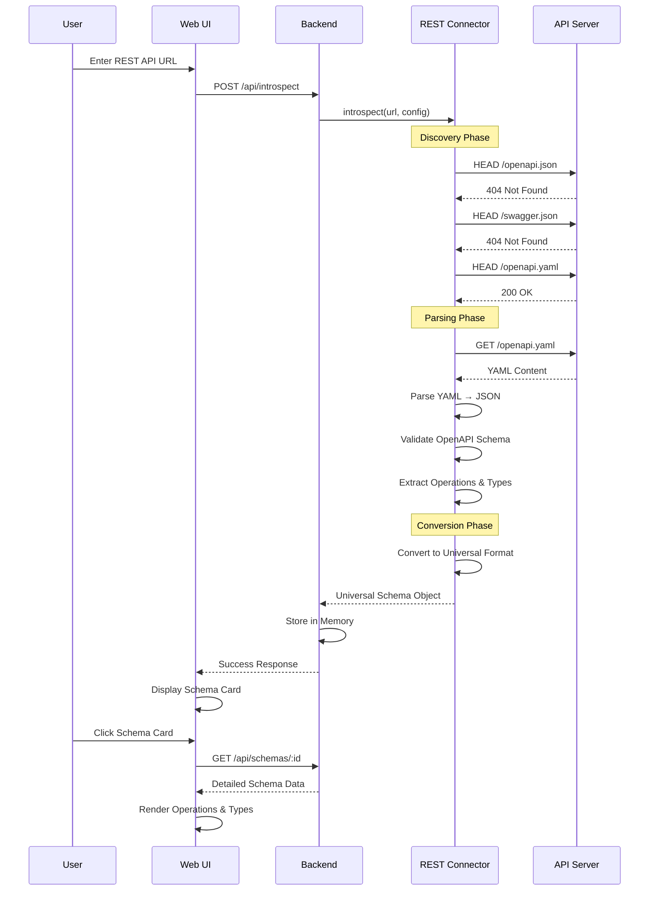
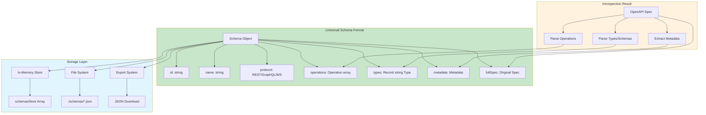

# Universal API Schema Explorer

A comprehensive, multi-protocol API discovery and exploration platform that automatically introspects REST, GraphQL, and WebSocket APIs to generate unified schema documentation and interactive testing interfaces.


## 🌟 Overview

The Universal API Schema Explorer is a modern, full-stack application designed to bridge the gap between different API protocols by providing a unified interface for discovery, documentation, and testing. Whether you're working with REST APIs, GraphQL endpoints, or WebSocket connections, this tool automatically introspects and documents your APIs in a consistent, explorable format.

## 🚀 Quick Start (One Command!)

```bash
# Clone and start everything from the root directory
git clone https://github.com/wrappeddev/OpenAPI-Spec-Parser.git
cd universal-api-explorer

# Install all dependencies and start both frontend and backend
npm run install:all
npm run dev:full
```

**That's it!** The application will be available at:
- **Web Interface**: http://localhost:5174
- **Backend API**: http://localhost:3001

## ✨ Key Features

### 🔍 **Multi-Protocol Introspection**
- **REST APIs**: Automatic OpenAPI/Swagger specification discovery and parsing
- **GraphQL**: Schema introspection with type and operation analysis
- **WebSocket**: Real-time message capture and protocol analysis
- **Smart Detection**: Automatic protocol detection from URLs

### 📊 **Interactive Web Interface**
- **Modern React Frontend**: Built with TypeScript, Tailwind CSS 3.4, and Vite
- **Real-time Visualization**: Dynamic schema exploration with expandable components
- **Dark Mode Support**: Toggle between light and dark themes
- **Responsive Design**: Works seamlessly on desktop and mobile devices

### 🛠️ **Advanced Features**
- **Live WebSocket Testing**: Real-time message capture and analysis
- **Schema Export**: Download schemas in JSON format
- **Bulk Operations**: Delete multiple schemas at once
- **Search & Filter**: Find APIs by protocol, name, or content
- **Error Boundaries**: Graceful error handling and recovery

### 🏗️ **Robust Architecture**
- **CLI Backend**: Node.js command-line interface for headless operation
- **Express.js API**: RESTful backend for web interface integration
- **Modular Connectors**: Extensible protocol-specific adapters
- **Type Safety**: Full TypeScript implementation throughout

## 📋 Available Scripts

All scripts can be run from the root directory:

```bash
# Development
npm run dev:full          # Start both frontend and backend with hot reload
npm run dev:web           # Start only the web interface
npm run dev:backend       # Start only the backend server

# Production
npm run start:full        # Start both in production mode
npm run build:web         # Build the web interface
npm run build             # Build the CLI

# Maintenance
npm run install:all       # Install all dependencies (root, web-ui, backend)
npm run test              # Run CLI tests
npm run test:web          # Run web interface tests
npm run clean:all         # Clean all build artifacts and node_modules
```

## 🔄 Complete Process Flow

Here's exactly how the Universal API Schema Explorer works from start to finish:

### 1. API Discovery & Introspection Process



### 2. Web Interface Architecture & Data Flow



### 5. User Interaction Flow



## 📖 Usage Examples

### 🖥️ CLI Usage

```bash
# Build the CLI first
npm run build

# Introspect a REST API with OpenAPI spec
npm run cli introspect rest https://petstore.swagger.io/v2/swagger.json --save

# Introspect a YAML OpenAPI spec (now supported!)
npm run cli introspect rest https://raw.githubusercontent.com/microsoftgraph/msgraph-metadata/refs/heads/master/openapi/v1.0/openapi.yaml --save

# Discover GraphQL schema
npm run cli introspect graphql https://countries.trevorblades.com/ --save

# Analyze WebSocket API
npm run cli introspect websocket wss://echo.websocket.org --save --duration 30000

# List all discovered schemas
npm run cli list --verbose

# Export schema details
npm run cli show rest_petstore_123 --operations --types
```

### 🌐 Web Interface Usage

1. **Dashboard**: View all discovered APIs with filtering and search
2. **Introspection**: Add new APIs using the guided introspection form
3. **Schema Details**: Explore operations, types, and live WebSocket connections
4. **Settings**: Configure dark mode and manage stored schemas

### 3. REST API Introspection Deep Dive



### 4. Schema Storage & Retrieval



## 📁 Detailed Project Structure

```
universal-api-explorer/
├── 📦 Root Package (CLI & Core)
│   ├── src/
│   │   ├── connectors/          # Protocol-specific connectors
│   │   │   ├── rest/
│   │   │   │   ├── rest-connector.ts      # Main REST connector
│   │   │   │   ├── openapi-converter.ts   # OpenAPI → Universal format
│   │   │   │   └── openapi-types.ts       # TypeScript definitions
│   │   │   ├── graphql/
│   │   │   │   ├── graphql-connector.ts   # GraphQL introspection
│   │   │   │   └── graphql-converter.ts   # Schema conversion
│   │   │   └── websocket/
│   │   │       ├── websocket-connector.ts # WebSocket analyzer
│   │   │       └── message-analyzer.ts    # Protocol detection
│   │   ├── core/
│   │   │   ├── schema.ts        # Universal schema types
│   │   │   ├── storage.ts       # File/memory persistence
│   │   │   └── registry.ts      # Connector registry
│   │   ├── cli/
│   │   │   ├── commands/        # CLI command implementations
│   │   │   └── utils/           # CLI utilities
│   │   ├── types/               # Shared TypeScript types
│   │   └── utils/               # Common utilities
│   ├── package.json             # 🎯 Root scripts (npm run dev:full)
│   └── tsconfig.json
│
├── 🌐 Web Interface
│   ├── web-ui/
│   │   ├── src/
│   │   │   ├── components/      # React components
│   │   │   │   ├── Layout.tsx           # App layout & navigation
│   │   │   │   ├── OperationViewer.tsx  # REST operation details
│   │   │   │   ├── SchemaTypeViewer.tsx # Type/schema explorer
│   │   │   │   ├── SchemaOverview.tsx   # Schema summary cards
│   │   │   │   └── WebSocketViewer.tsx  # Live WebSocket tester
│   │   │   ├── pages/           # Page components
│   │   │   │   ├── Dashboard.tsx        # Main schema list
│   │   │   │   ├── Introspect.tsx       # Add new API form
│   │   │   │   ├── SchemaDetail.tsx     # Detailed schema view
│   │   │   │   └── Settings.tsx         # App settings & dark mode
│   │   │   ├── contexts/
│   │   │   │   └── AppContext.tsx       # Global state management
│   │   │   ├── services/
│   │   │   │   └── api.ts               # Backend API client
│   │   │   └── lib/             # Utility functions
│   │   ├── backend/             # 🚀 Express.js API server
│   │   │   ├── server.js        # Main server (supports JSON & YAML!)
│   │   │   └── package.json     # Backend dependencies
│   │   ├── package.json         # Frontend dependencies
│   │   └── vite.config.ts       # Vite build configuration
│
├── 📚 Documentation & Examples
│   ├── docs/                    # Detailed documentation
│   ├── examples/                # Usage examples
│   └── tests/                   # Test suites
│
└── 🔧 Configuration Files
    ├── .env.example             # Environment variables template
    ├── .gitignore
    ├── LICENSE
    └── README.md                # This file!
```

## 🔧 Configuration

### Environment Variables

Create a `.env` file in the project root:

```env
# Backend Configuration
BACKEND_PORT=3001
BACKEND_HOST=localhost

# Frontend Configuration
VITE_API_BASE_URL=http://localhost:3001

# CLI Configuration
CLI_STORAGE_DIR=./schemas
CLI_DEFAULT_TIMEOUT=30000

# Development Settings
NODE_ENV=development

# Optional: Custom Headers for API Introspection
DEFAULT_USER_AGENT=Universal-API-Schema-Explorer/1.0.0
```

### Supported API Formats

| Protocol | Format | Support Level | Notes |
|----------|--------|---------------|-------|
| **REST** | OpenAPI 3.x JSON | ✅ Full | Complete operation & type extraction |
| **REST** | OpenAPI 3.x YAML | ✅ Full | YAML parsing now supported! |
| **REST** | Swagger 2.0 JSON | ✅ Full | Legacy format support |
| **REST** | Swagger 2.0 YAML | ✅ Full | Legacy YAML support |
| **GraphQL** | Introspection | 🚧 Partial | Schema discovery implemented |
| **WebSocket** | Live Analysis | 🚧 Partial | Connection testing available |

### Common API Discovery Paths

The REST connector automatically tries these paths:

```
/openapi.json          /openapi.yaml
/swagger.json          /swagger.yaml
/api-docs              /api/docs
/docs/openapi.json     /docs/swagger.json
/v1/openapi.json       /v1/swagger.json
/api/v1/openapi.json   /api/v1/swagger.json
```

## 🧪 Testing

```bash
# Run CLI tests
npm test

# Run web UI tests
cd web-ui
npm test

# Run integration tests
npm run test:integration

# Generate coverage report
npm run test:coverage
```

## 🚀 Deployment

### Docker Deployment

```bash
# Build and run with Docker Compose
docker-compose up -d

# Or build manually
docker build -t api-explorer-web ./web-ui
docker run -p 3000:3000 api-explorer-web
```

### Production Build

```bash
# Build CLI
npm run build

# Build web UI
cd web-ui
npm run build

# The built files will be in dist/ and web-ui/dist/
```

## 🚀 Production Deployment

### Docker Deployment (Recommended)

```bash
# Build and run with Docker Compose
docker-compose up -d

# Or build manually
docker build -t api-explorer-web ./web-ui
docker run -p 3000:3000 api-explorer-web
```

### Manual Production Build

```bash
# Build everything
npm run build          # Build CLI
npm run build:web      # Build web interface

# Start in production
npm run start:full     # Start both frontend and backend
```

## 🤝 Contributing

We welcome contributions! Here's how to get started:

### Development Setup

```bash
# 1. Fork and clone the repository
git clone https://github.com/your-username/universal-api-explorer.git
cd universal-api-explorer

# 2. Install all dependencies
npm run install:all

# 3. Start development environment
npm run dev:full

# 4. Create a feature branch
git checkout -b feature/amazing-feature

# 5. Make your changes and test
npm test && npm run test:web

# 6. Commit and push
git commit -m 'feat: add amazing feature'
git push origin feature/amazing-feature
```

### Code Standards

- **TypeScript**: Strict mode with comprehensive type definitions
- **ESLint**: Airbnb configuration with custom rules
- **Prettier**: Automatic code formatting on save
- **Conventional Commits**: Structured commit messages (feat:, fix:, docs:)
- **Testing**: Jest for CLI, Vitest for web interface
- **Documentation**: Update READMEs and add JSDoc comments

## 📄 License

This project is licensed under the MIT License - see the [LICENSE](LICENSE) file for details.

## 🙏 Acknowledgments

- [OpenAPI Specification](https://swagger.io/specification/) for REST API standards
- [GraphQL](https://graphql.org/) for query language inspiration
- [WebSocket Protocol](https://tools.ietf.org/html/rfc6455) for real-time communication
- [React](https://reactjs.org/) and [Tailwind CSS](https://tailwindcss.com/) for the modern UI
- [Node.js](https://nodejs.org/) ecosystem for the robust backend

## 🔧 Troubleshooting

### Common Issues

**Q: Dark mode flashes light theme on page reload**
```bash
# Fixed! Dark mode now applies immediately on page load
# No action needed - this was resolved in the latest version
```

**Q: YAML OpenAPI specs fail to introspect**
```bash
# Fixed! YAML parsing is now fully supported
# Try introspecting: https://raw.githubusercontent.com/microsoftgraph/msgraph-metadata/refs/heads/master/openapi/v1.0/openapi.yaml
```

**Q: Backend server won't start**
```bash
# Check if port 3001 is already in use
netstat -an | findstr :3001

# Kill existing processes and restart
npm run clean:all
npm run install:all
npm run dev:full
```

**Q: Frontend can't connect to backend**
```bash
# Verify backend is running on port 3001
curl http://localhost:3001/api/status

# Check VITE_API_BASE_URL in .env file
echo $VITE_API_BASE_URL  # Should be http://localhost:3001
```

### Performance Tips

- **Large APIs**: Use filtering and search to navigate schemas with 100+ operations
- **Memory Usage**: Clear browser cache if experiencing slowdowns
- **Network**: Use local OpenAPI specs for faster introspection during development


### Quick Links

- [API Examples](examples/)
- [Development Guide](docs/development.md)
- [Deployment Guide](docs/deployment.md)
- [Contributing Guidelines](CONTRIBUTING.md)

---

**Made with ❤️ by the Universal API Schema Explorer team**

*Bridging the gap between API protocols, one schema at a time.*
