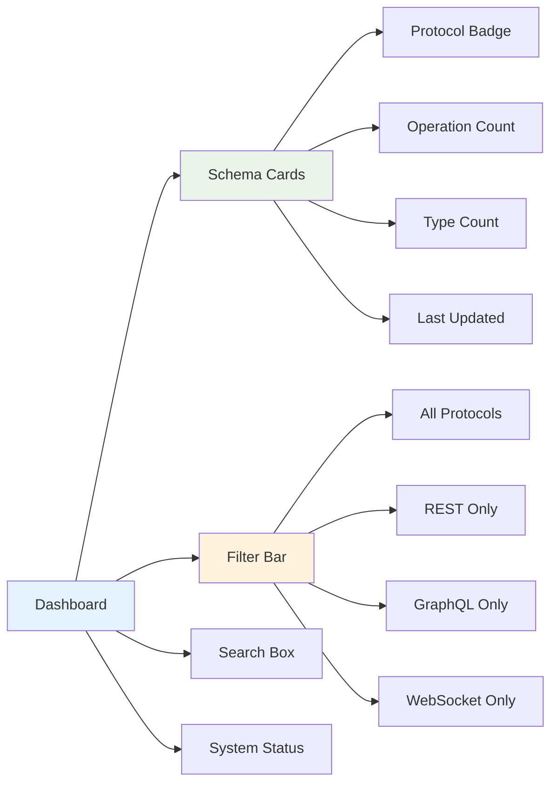

# Universal API Schema Explorer - Web UI

Modern React-based web interface for the Universal API Schema Explorer with full dark mode support and real-time API introspection.

## ✨ Features

- 🌐 **Multi-protocol API introspection** (REST, GraphQL, WebSocket)
- 📊 **Interactive schema visualization** with expandable components
- 🌙 **Complete dark mode support** (no more flashing!)
- 📱 **Responsive design** for desktop and mobile
- ⚡ **Real-time WebSocket testing** with live message capture
- 💾 **Schema export functionality** (JSON download)
- 🗂️ **Bulk schema management** with search and filtering
- 🔍 **Deep operation exploration** with parameters and responses
- 🎨 **Modern UI** with Tailwind CSS 3.4 and smooth animations
- ⚙️ **Persistent settings** with localStorage integration

## 🚀 Quick Start

### Prerequisites

- Node.js 18+ and npm
- Modern web browser (Chrome, Firefox, Safari, Edge)

### Installation

```bash
# Option 1: Start from root directory (recommended)
cd universal-api-explorer
npm run install:all
npm run dev:full

# Option 2: Start from web-ui directory
cd universal-api-explorer/web-ui
npm install
cd backend && npm install && cd ..
npm run dev:full
```

The application will be available at:
- **Frontend**: http://localhost:5174 (Vite dev server)
- **Backend API**: http://localhost:3001 (Express.js server)

### Development Scripts

```bash
# Frontend Development
npm run dev              # Start Vite dev server (hot reload)
npm run build            # Build for production
npm run preview          # Preview production build

# Backend Development
npm run backend:dev      # Start backend with nodemon (auto-restart)
npm run backend:start    # Start backend in production mode

# Full Stack Development
npm run dev:full         # Start both frontend and backend
npm run start:full       # Start both in production mode

# Testing & Quality
npm test                 # Run frontend tests
npm run lint             # Run ESLint
npm run type-check       # TypeScript type checking
```

## 📖 Detailed Usage Guide

### 1. 🏠 Dashboard - Your API Command Center

The dashboard provides a comprehensive overview of all discovered APIs:



**Features:**
- **Smart Filtering**: Filter by protocol type with real-time updates
- **Global Search**: Find APIs by name, description, or URL
- **Visual Status**: Color-coded cards showing API health
- **Quick Actions**: Export, delete, or explore schemas directly from cards

### 2. 🔍 API Introspection - Add New APIs

The introspection page guides you through adding new APIs:

**REST API Introspection:**
- Supports both JSON and YAML OpenAPI specifications
- Automatic discovery of common spec paths
- Custom header support for authenticated endpoints
- Real-time validation and error reporting

**GraphQL Introspection:**
- Automatic schema discovery via introspection queries
- Type and operation extraction
- Mutation and subscription detection

**WebSocket Analysis:**
- Live connection testing
- Message pattern analysis
- Protocol detection and documentation

### 3. 📊 Schema Exploration - Deep Dive into APIs

**Operations View:**
- Expandable operation details with parameters
- Request/response schema visualization
- HTTP method color coding
- Parameter location indicators (query, path, body, header)

**Types View:**
- Interactive type tree with expand/collapse
- Reference resolution and navigation
- Property details with examples
- Enum value display

**Live WebSocket Testing:**
- Real-time message capture
- Send custom messages
- Connection status monitoring
- Message history and filtering

## 🏗️ Architecture

```
┌─────────────────┐    HTTP/REST    ┌─────────────────┐
│   React App     │ ◄──────────────►│   Express.js    │
│  (Frontend)     │                 │   (Backend)     │
│                 │                 │                 │
│ • Dashboard     │                 │ • /api/schemas  │
│ • Introspection │                 │ • /api/status   │
│ • Visualization │                 │ • /api/test     │
└─────────────────┘                 └─────────────────┘
```

### Tech Stack

**Frontend:**
- React 18 with TypeScript
- Tailwind CSS 3.4
- React Router for navigation
- Context API for state management
- Heroicons for UI icons

**Backend:**
- Express.js with CORS
- RESTful API design
- JSON-based communication

## 🔧 Configuration

### Environment Variables

Create a `.env` file in the root directory:

```env
# Backend Configuration
BACKEND_PORT=3001
BACKEND_HOST=localhost

# Frontend Configuration
VITE_API_BASE_URL=http://localhost:3001
```

### API Configuration

The frontend connects to the backend API at `http://localhost:3001` by default. To change this, update the `ApiService` constructor in `src/services/api.ts`.

## 📁 Project Structure

```
web-ui/
├── src/
│   ├── components/          # Reusable UI components
│   │   ├── Layout.tsx       # Main application layout
│   │   ├── OperationViewer.tsx
│   │   ├── SchemaTypeViewer.tsx
│   │   └── WebSocketViewer.tsx
│   ├── pages/               # Page components
│   │   ├── Dashboard.tsx
│   │   ├── Introspect.tsx
│   │   ├── SchemaDetail.tsx
│   │   └── Settings.tsx
│   ├── contexts/            # React contexts
│   │   └── AppContext.tsx
│   ├── services/            # API services
│   │   └── api.ts
│   └── lib/                 # Utilities
├── backend/                 # Express.js backend
│   ├── server.js
│   └── package.json
└── public/                  # Static assets
```

## 🤝 Contributing

1. Fork the repository
2. Create a feature branch (`git checkout -b feature/amazing-feature`)
3. Commit your changes (`git commit -m 'Add amazing feature'`)
4. Push to the branch (`git push origin feature/amazing-feature`)
5. Open a Pull Request

### Development Guidelines

- Follow TypeScript best practices
- Use Tailwind CSS for styling
- Write meaningful commit messages
- Add tests for new features
- Update documentation as needed

## 📝 License

This project is licensed under the MIT License - see the [LICENSE](LICENSE) file for details.

## 🙏 Acknowledgments

- [Tailwind CSS](https://tailwindcss.com/) for the utility-first CSS framework
- [Heroicons](https://heroicons.com/) for beautiful SVG icons
- [React](https://reactjs.org/) for the component library
- [Vite](https://vitejs.dev/) for the fast build tool

---

**Made with ❤️ by the Universal API Schema Explorer team**
